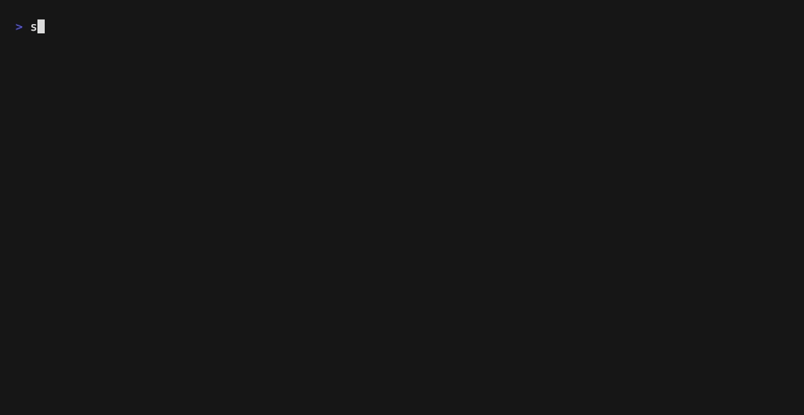

# simshot

**[English](README.md) · [日本語](README.ja.md) · [한국어](README.ko.md)**


iOS 시뮬레이터에서 **`simctl`만으로** App Store 제출용 스크린샷을 자동 촬영하는 CLI입니다. **XCUITest 불필요** · 테스트 러너 기인 행(hang) 없음.

> ⭐ simshot이 릴리스 작업을 편하게 해줬다면 스타를 주시면 감사하겠습니다. 질문이나 아이디어는 [Discussions](https://github.com/kichiemon/simshot/discussions)로 부탁드립니다.



앱 쪽은 `#if DEBUG`로 기동 인자 프로토콜을 해석하는 작은 핸들러를 구현하기만 하면 됩니다. 이후 simshot이 「빌드 → 시뮬레이터 부팅 → 상태 바 덮어쓰기 → 각 씬으로 launch → 촬영 → App Store 크기로 리사이즈」까지 한 번에 처리합니다.

```bash
simshot shoot --project MyApp.xcodeproj --scheme MyApp \
  --bundle-id com.example.myapp \
  --devices iphone-17-pro-max,ipad-pro-13 \
  --langs ja,en --shots shots.json --resize
```

## 왜 simshot인가

`fastlane snapshot`은 **XCUITest**로 UI를 조작하므로, 테스트 타깃 유지·깨지기 쉬운 요소 쿼리·러너 크래시와 싸워야 합니다. simshot은 모델을 뒤집었습니다. **앱 자신**이 각 씬으로 이동하고(공개된 기동 인자 프로토콜 해석), simshot은 모든 단계에 하드 타임아웃이 걸린 `simctl`만 호출합니다.

| | simshot | fastlane snapshot |
|---|---|---|
| UI 자동 조작 | **불필요** — `simctl`만 | XCUITest 러너 |
| 행(hang) | **모든 명령에 하드 타임아웃** | CI를 멈출 수 있음 |
| Ruby | **불필요** | Ruby + fastlane + gem |
| 테스트 타깃 | 앱 내 `#if DEBUG` 핸들러 | 전용 UI 테스트 타깃 |
| 상태 바 덮어쓰기 | **내장** | 플러그인 |
| App Store 크기 리사이즈 | **내장**(`--resize`) | 별도 도구 |
| 다국어 | `--langs ja,en` | 로케일별 설정 |
| 의존성 | **0개** | gem 다수 |

> **Xcode 27 / Device Hub 지원:** simshot은 `xcrun simctl`만 사용하고 `Simulator.app`을 열지 않으므로, Simulator.app을 대체한 Device Hub(Xcode 27)에서도 그대로 동작합니다.


## 동작 원리

1. `xcodebuild`로 generic simulator용 빌드(`--app-path`로 기존 `.app`도 가능).
2. 디바이스 × 언어별로:
   - `simctl bootstatus <udid> -b`로 부팅 및 대기.
   - `simctl status_bar <udid> override --time "9:41" --batteryState charged --batteryLevel 100 ...`로 상태 바를 정돈.
   - 앱 설치(이전 설치분은 제거하여 클린하게).
   - 셧마다 씬 기동 인자로 launch → 씬이 안정될 때까지 대기 → `simctl io <udid> screenshot`.
3. 원본은 `<output>/raw/<device>/<lang>/`, `--resize` 지정 시 알파 제거·리사이즈된 제출용 이미지를 `<output>/<device>/<lang>/`에 출력.

모든 외부 명령은 **타임아웃＋리트라이** 래퍼를 거치므로, 크래시나 시뮬레이터 고착에도 CI를 멈추지 않습니다.

## 설치

`simshot`을 설치하는 방법은 8가지입니다. 하나만 고르면 됩니다:

| # | 방법 | 명령 | 필요 |
|---|---|---|---|
| 1 | 설치 스크립트 (curl) | `curl -fsSL …/install.sh \| bash` | macOS |
| 2 | Homebrew (tap) | `brew tap kichiemon/homebrew-tap && brew install simshot` | Homebrew |
| 3 | 단일 바이너리 (curl) | `simshot-macos-{arm64,x86_64}` 내려받기 | macOS |
| 4 | Nix | `nix profile install github:kichiemon/simshot` | Nix |
| 5 | mise | `mise use -g github:kichiemon/simshot` | mise |
| 6 | npm | `npm i -g simshot` | Node.js 14+ |
| 7 | Mint | `mint install kichiemon/simshot` | Xcode |
| 8 | 소스에서 빌드 | `swift build -c release` | Xcode |
| + | 에이전트 스킬 | `npx skills add kichiemon/simshot` | npx |

### 설치 스크립트 (curl, macOS)

아키텍처를 자동으로 감지해 GitHub Releases에서 일치하는 사전 빌드 바이너리를 내려받고 sha256을 검증한 뒤 `/usr/local/bin`(또는 `~/.local/bin`)에 설치하는 원라이너:

```bash
curl -fsSL https://raw.githubusercontent.com/kichiemon/simshot/main/install.sh | bash
```

`SIMSHOT_VERSION`(릴리스 태그)과 `SIMSHOT_INSTALL_DIR`로 바꿀 수 있습니다:

```bash
SIMSHOT_VERSION=v0.2.1 SIMSHOT_INSTALL_DIR=~/.local/bin \
  curl -fsSL https://raw.githubusercontent.com/kichiemon/simshot/main/install.sh | bash
```

### 에이전트 스킬로 설치 (npx)

```bash
npx skills add kichiemon/simshot
```

simshot을 재사용 가능한 에이전트 스킬로 도입합니다(Claude Code / opencode 등 스킬 지원 에이전트용). 설치 후에는 에이전트가 자동으로 활용할 수 있습니다. "App Store 스크린샷을 촬영해 줘"라고 하면 에이전트가 `simshot shoot`을 조합해 실행합니다(자세한 내용은 [`skills/simshot/SKILL.md`](skills/simshot/SKILL.md) 참조).

### 소스에서 빌드

```bash
git clone https://github.com/kichiemon/simshot.git
cd simshot
swift build -c release
# 바이너리는 .build/release/simshot
ln -s "$(pwd)/.build/release/simshot" /usr/local/bin/simshot
```

### 단일 바이너리 (curl, macOS)

GitHub Releases에서 해당 아키텍처의 프리빌드 바이너리를 직접 받습니다(Swift 툴체인 불필요):

```bash
# Apple Silicon (arm64)
curl -sL https://github.com/kichiemon/simshot/releases/download/v0.2.1/simshot-macos-arm64 -o /usr/local/bin/simshot && chmod +x /usr/local/bin/simshot

# Intel (x86_64)
curl -sL https://github.com/kichiemon/simshot/releases/download/v0.2.1/simshot-macos-x86_64 -o /usr/local/bin/simshot && chmod +x /usr/local/bin/simshot
```

### Nix

리포지토리에 [`flake.nix`](flake.nix)가 포함되어 있으며 프리빌드 단일 바이너리를 가져옵니다(소스 빌드 없음):

```bash
nix run github:kichiemon/simshot          # 설치 없이 실행
nix profile install github:kichiemon/simshot   # 프로필에 설치
```

### mise

[mise](https://mise.jdx.dev/)는 GitHub Releases 에셋에서 simshot을 설치할 수 있습니다. **github backend**가 권장됩니다(SLSA 출처·artifact attestation도 검증):

```bash
mise use -g github:kichiemon/simshot   # 전역 설정에 설치
simshot --version                      # v0.2.1
```

기존 `ubi` backend(`mise use ubi:kichiemon/simshot`)도 같은 `simshot-macos-{os}-{arch}` 에셋을 해석하여 동작하지만, mise에서 deprecated이며 mise 2027.1.0에서 제거될 예정입니다.

### Homebrew (tap)

```bash
brew tap kichiemon/homebrew-tap
brew install simshot
```

릴리스된 바이너리를 설치하는 Formula는 [`kichiemon/homebrew-tap`](https://github.com/kichiemon/homebrew-tap)(`Formula/simshot.rb`)에 있습니다.

### Mint

[Mint](https://github.com/yonaskolb/Mint)는 [`Mintfile`](Mintfile)을 통해 소스에서 빌드해 설치합니다(Xcode 필요):

```bash
brew install mint
mint install kichiemon/simshot
```

### npm (npmjs.com)

```bash
npm i -g simshot
npx simshot shoot
```

macOS(arm64 / x86_64) + Node.js 14+가 필요합니다. `postinstall`에서 GitHub Releases의 해당 아키텍처 프리빌드 단일 바이너리를 다운로드하고 sha256을 검증합니다(구현은 [`npm/`](npm/)). npm에는 `simshot`으로 공개되어 있습니다(v0.2.1).

## 퀵스타트

1. 앱에 [씬 기동 인자 핸들러](#screenshot-scene-protocol)를 추가(5분).
2. 환경 확인과 시뮬레이터 목록:

   ```bash
   simshot doctor     # xcode-select / Xcode / simctl / 런타임 진단
   simshot devices    # 사용 가능한 시뮬레이터 목록
   ```

3. `shots.json`을 작성([`examples/shots.json`](examples/shots.json) 참조)하거나 `--scenes` 사용:

   ```bash
   simshot shoot --project MyApp.xcodeproj --scheme MyApp \
     --bundle-id com.example.myapp \
     --devices iphone-17-pro-max,ipad-pro-13 \
     --langs ja,en --scenes home,detail,settings \
     --output appstore --resize
   ```

촬영 결과는 `appstore/<device>/<lang>/NN_name.png`에 저장됩니다.

## 커맨드

| 커맨드 | 설명 |
|---|---|
| `simshot shoot <options>` | 빌드·부팅·촬영·리사이즈 일괄 실행 |
| `simshot devices` | 사용 가능한 시뮬레이터 목록(이름 + UDID) |
| `simshot doctor` | 로컬 Xcode / 시뮬레이터 환경 진단(문제 시 exit 1) |
| `simshot init` | 주석 포함 `simshot.yml` 스캐폴드 생성 |
| `simshot verify [dir]` | 촬영 결과가 App Store 요구사항을 충족하는지 검증(문제 시 exit 1) |
| `simshot version` | 버전 표시 |
| `simshot help` | 도움말 표시 |

### `simshot doctor`

`xcode-select` / Xcode / `simctl` / iOS 런타임 / 사용 가능한 시뮬레이터를 검사하고, 이상이 있으면 exit `1`을 반환합니다. 새 머신 셋업이나 버그 리포트 전에 실행하세요.

```text
$ simshot doctor
✅ xcode-select: /Applications/Xcode.app/Contents/Developer
✅ Xcode: Xcode 27.0
✅ simctl: found
✅ iOS runtimes: 7 installed
✅ Available simulators: 36 available

✅ All checks passed.
```

### `simshot init`

`simshot shoot`에 넘길 옵션을 문서화한 주석 포함 `simshot.yml` 스캐폴드를 생성합니다. 기본은 대화식, `--yes`로 플레이스홀더 값 그대로 작성합니다.

```bash
simshot init --yes   # → simshot.yml(주석 포함 템플릿)
```

### `simshot verify`

`simshot shoot`이 만든 트리를 Apple의 스크린샷 규정에 비추어 검증합니다. App Store Connect에서 거부될 요소가 먼저 여기서 걸리므로(exit `1`) CI 게이트로 쓸 수 있습니다.

```text
simshot verify — appstore

✅ iphone-17-pro-max/ja  3 files  1290×2796 (6.7inch)
❌ iphone-17-pro-max/en  2 files  1290×2796 (6.7inch)

❌ iphone-17-pro-max/en/02_detail.png
   image has an alpha channel — App Store Connect rejects these
   → run shoot with `--resize` to write flattened App Store copies
```

허용 크기가 아닌 해상도, 알파 채널, 같은 폴더 안의 크기 혼재, 비어 있거나 빠진 기기/언어 폴더를 찾아냅니다. `raw/`는 건너뛰고, `--devices`/`--langs`는 해당 폴더의 존재를 요구하며, `--json`으로 기계 판독용 리포트를 출력합니다.

## `simshot shoot` 옵션

```
BUILD
  --project <path.xcodeproj>       Xcode 프로젝트(--workspace와 배타)
  --workspace <path.xcworkspace>   Xcode 워크스페이스
  --scheme <name>                  Scheme 이름
  --app-path <path.app>            빌드 없이 기존 .app 사용

REQUIRED
  --bundle-id <id>                 번들 식별자
  --devices <list>                 시뮬레이터 이름 or UDID(쉼표 구분)

SHOTS
  --shots <config.json>            셧 설정 파일({ "shots": [...] })
  --scenes <list>                  쇼트컷: 씬마다 1장(예 home,trace)
  --wait <secs>                    --scenes용 대기 초(기본: 6)

LOCALIZATION
  --langs <list>                   언어(기본: en) 예: ja,en
  --locales <map>                  lang=locale 오버라이드(예 ja=ja_JP,en=en_US)

OUTPUT
  --output <dir>                   출력 디렉터리(기본: appstore)
  --resize                         App Store 제출용 이미지도 출력(알파 제거)
  --derived-data <dir>             DerivedData 경로(기본: ~/.simshot/DerivedData)

SIMULATOR
  --timeout <secs>                 외부 명령 타임아웃(기본: 300)
  --status-bar-time <t>            상태 바 시계(기본: 9:41)
  --status-bar-battery <n>         상태 바 배터리%(기본: 100)
  --no-ui-testing                  --ui-testing을 넘기지 않음
  --no-clean                       설치 전에 제거하지 않음
  --keep-running                   촬영 후 시뮬레이터를 종료하지 않음

MISC
  --verbose, -v                    상세 출력
  --help, -h                       도움말 표시
```

### 디바이스 지정

`--devices`는 디바이스 이름 또는 UDID를 받습니다:

```bash
simshot shoot ... --devices iphone-17-pro-max,ipad-pro-13
simshot shoot ... --devices 67DF6727-31BC-4246-9FC0-313A22FB2A6C
```

이름은 대소문자·하이픈 구분을 무시하고 매칭합니다. 여러 iOS 런타임에 동명 디바이스가 있으면 **최신 런타임**을 우선합니다. 출력 하위 디렉터리는 전달한 이름(UDID의 경우 디바이스 이름 슬러그)이 됩니다.

### 셧 설정

`shots.json`으로 파일명·씬·대기 초를 세밀하게 제어할 수 있습니다. `name`과 `scene` 이외는 생략 가능합니다.

```json
{
  "shots": [
    { "name": "04_home.png", "scene": "home", "wait": 8 },
    { "name": "01_trace.png", "scene": "trace", "strokes": 1, "wait": 6 },
    { "name": "06_store.png", "scene": "store", "wait": 8 },
    { "name": "07_store_tip.png", "scene": "store", "scrollBottom": true, "wait": 8 }
  ]
}
```

| 필드 | 타입 | 기본값 | 의미 |
|---|---|---|---|
| `name` | string | — | 출력 파일명(예 `04_home.png`) |
| `scene` | string | — | `--screenshot-scene`으로 전달할 씬 이름 |
| `strokes` | int | `nil` | `--screenshot-strokes`로 전달할 값 |
| `scrollBottom` | bool | `false` | `--screenshot-scroll-bottom` 전달 |
| `wait` | int | `6` | launch 후 촬영까지 대기 초 |
| `uiTesting` | bool | `true` | `--ui-testing` 전달 여부 |

파일 형식은 셧의 단순 배열 또는 `{ "shots": [...] }` 모두 가능합니다.

## Screenshot scene protocol (씬 기동 인자 프로토콜)

simshot은 앱을 고정 인자 세트로 launch합니다. **씬 이름과 동작은 앱 쪽 자유** — simshot은 그대로 전달할 뿐입니다.

| 인자 | 의미 |
|---|---|
| `--ui-testing` | 자동 촬영 세션임을 알림(온보딩 등 스킵). |
| `--screenshot-scene <scene>` | 기동 직후 지정 씬으로 이동. |
| `--screenshot-strokes <N>` | N회 인터랙션 실행(예: 긋기 N획). 생략 가능. |
| `--screenshot-scroll-bottom` | 씬을 최하단까지 스크롤 후 촬영. 생략 가능. |

또한 simshot은 항상 `-AppleLanguages (lang)`와 `-AppleLocale locale`도 넘겨 앱이 지정 언어로 표시되게 합니다.

### 앱 쪽 구현 예 (SwiftUI)

```swift
import SwiftUI

struct HomeView: View {
    @State private var path: [Character] = []
    @State private var showSettings = false

    var body: some View {
        NavigationStack(path: $path) {
            content
                .onAppear {
                    #if DEBUG
                    handleScreenshotScene()
                    #endif
                }
        }
        .sheet(isPresented: $showSettings) {
            SettingsView()
        }
    }

    #if DEBUG
    /// 스크린샷 촬영 전용: simshot의 기동 인자를 해석해 해당 화면으로 직행한다.
    private func handleScreenshotScene() {
        let args = ProcessInfo.processInfo.arguments
        guard let index = args.firstIndex(of: "--screenshot-scene"),
              index + 1 < args.count else { return }
        let scene = args[index + 1]
        DispatchQueue.main.asyncAfter(deadline: .now() + 0.3) {
            switch scene {
            case "detail":
                if let first = characters.first {
                    path = [first]
                }
            case "settings":
                showSettings = true
            default:
                break // "home"은 초기 화면
            }
        }
    }
    #endif
}
```

핸들러는 `#if DEBUG` 안에 있으므로 릴리스 빌드에 섞이지 않습니다.

## 리사이즈

`--resize`로 App Store 제출용 이미지를 `<output>/<device>/<lang>/`에 출력합니다:

1. 원본 이미지를 Apple이 공개한 스크린샷 크기와 대조(먼저 픽셀 완전 일치, 다음으로 비율 1% 이내). 이미 허용 크기인 원본은 확대하지 않고 그 해상도 그대로 사용합니다.
2. 알파 채널을 흰 배경에 합성해 제거.
3. 고품질 보간(LANCZOS 상당)으로 리사이즈 후 PNG로 저장.

현행 디바이스에서 허용되는 크기(가로/세로 모두. `verify`는 3.5인치 iPhone까지 Apple의 전체 목록을 허용합니다):

| 크기 | 디바이스 |
|---|---|
| 1320×2868 | iPhone 16 Pro Max / 17 Pro Max(6.9인치) |
| 1290×2796 | iPhone 14 Pro Max / 15 Plus / 16 Plus(6.7인치) |
| 1260×2736 | iPhone Air(6.5인치) |
| 1284×2778 | iPhone 12 Pro Max / 13 Pro Max |
| 1242×2688 | iPhone 11 Pro Max / XS Max(6.5인치) |
| 1206×2622 | iPhone 16 Pro / 17 Pro(6.3인치) |
| 1179×2556 | iPhone 15 / 16 / 17(6.1인치) |
| 1170×2532 | iPhone 12 / 13 / 14 |
| 1125×2436 | iPhone X / XS / 11 Pro |
| 1080×2340 | iPhone 12 mini |
| 1242×2208 | iPhone 6 Plus / 8 Plus |
| 750×1334 | iPhone 8 / SE(2·3세대) |
| 2064×2752 | iPad Pro 13인치 |
| 2048×2732 | iPad Pro 12.9인치 |
| 1668×2420 | iPad Pro 11인치(M4, M5) |
| 1668×2388 | iPad Pro 11인치(2018–2022) |
| 2266×1488 | iPad mini(6세대, A17 Pro) |
| 1640×2360 | iPad Air 11인치 / iPad(10세대, A16) |
| 1668×2224 | iPad Pro 10.5인치 / iPad(9세대) |
| 1536×2048 | iPad 9.7인치 |
| 768×1024 | iPad mini |

iPad 10.2인치 화면은 2160×1620으로 캡처되지만 이는 제출 크기가 아닙니다(이 디스플레이 등급은 1668×2224로 제출). 따라서 10.2인치 원본은 그대로 통과시키지 않고 iPad 13인치 크기로 리사이즈합니다.

대응하는 크기가 없으면(비율이 1% 이상 어긋나면) 경고하고 원본 그대로 둡니다.

## 출력 디렉터리

```
appstore/
├── raw/
│   └── iphone-17-pro-max/
│       ├── ja/
│       │   ├── 04_home.png
│       │   └── 01_trace.png
│       └── en/
│           └── 04_home.png
└── iphone-17-pro-max/            # --resize: App Store 제출용
    └── ja/
        └── 04_home.png
```

## 신뢰성

- **타임아웃**: 모든 외부 명령(xcodebuild / simctl 등)은 `--timeout`을 넘으면 강제 종료. 시뮬레이터 고착에도 CI를 멈추지 않습니다.
- **리트라이**: `launch` / `install` / `screenshot`은 실패 시 자동 리트라이.
- **디바이스별 격리**: 실패한 디바이스는 보고 후 스킵하고 매트릭스 전체는 계속 진행합니다.
- **클린 상태**: 설치 전에 제거. 상태를 남기려면 `--no-clean` / `--keep-running`.

## 개발

```bash
swift build   # 빌드
swift test    # 테스트 실행
swift format lint --recursive Sources Tests   # 코드 스타일
swift run simshot shoot --help
```

## 라이선스

[MIT](LICENSE)
